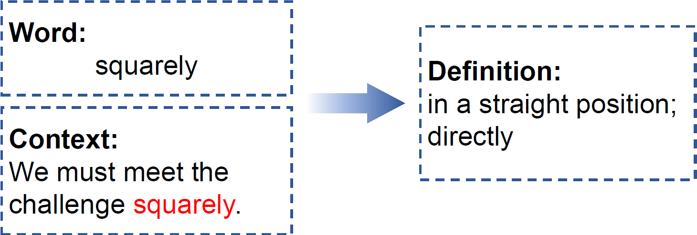
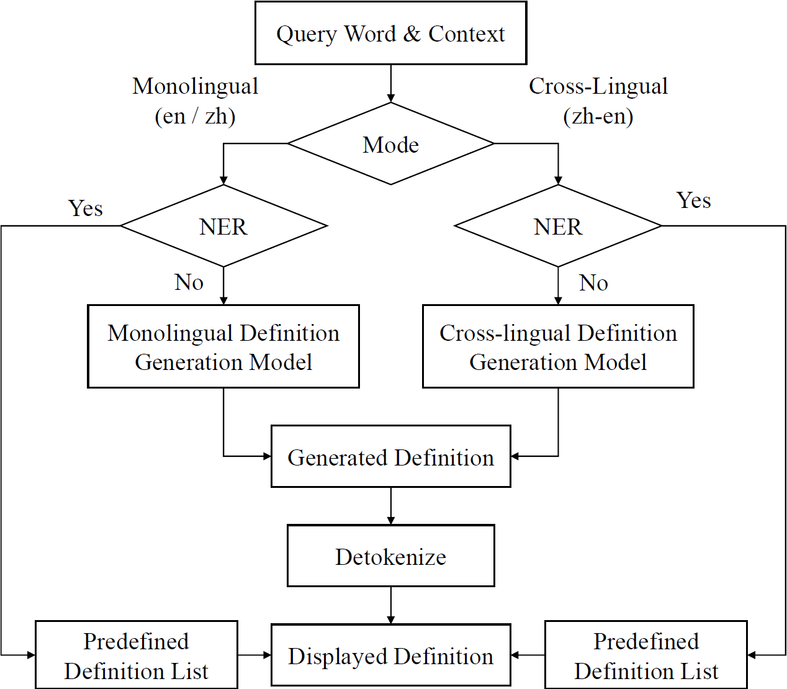
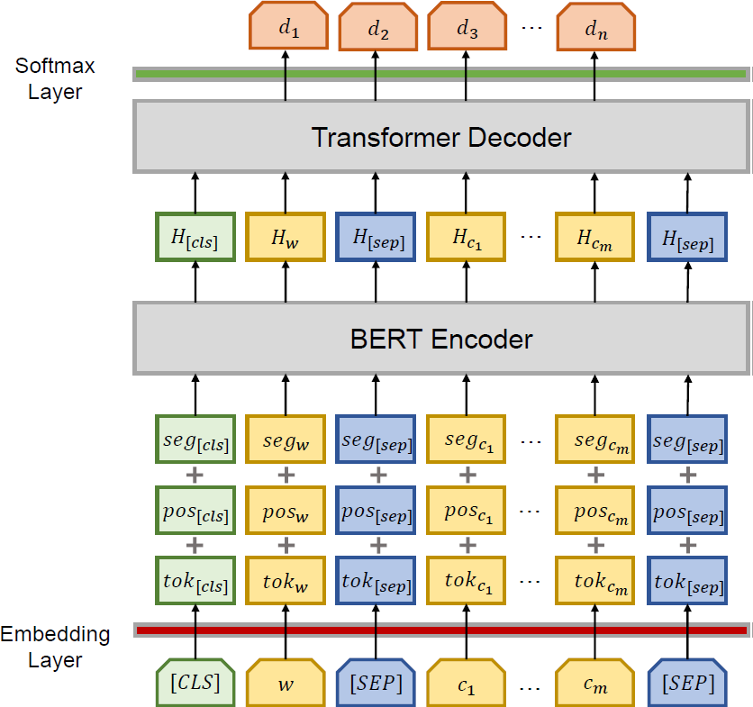

<p align="center">
  
</p>

## What is LitMind Dictionary?

LitMind Dictionary(https://dictionary.litmind.ink) is an open-source online generative dictionary that takes a word and context containing the word as input and automatically generates a definition as output.

<p align="center">
  
</p>

## Our System
### Workflow

The overall workflow of LitMind Dictionary

<p align="center">
  
</p>

### Definition Generation Model

The definition generation model (DGM) shown in the figure below is the core component of LitMind Dictionary. It is used to automatically generate the definition of a given word. The whole model is a transformer based encoder-decoder
model, where the encoder is initialized with BERT.

<p align="center">
  
</p>

## How to Run This Code?
### Web
``` bash
# init the project and install modules
npm install

# local run
npm run dev

# build
npm run build
```

### Server
``` bash
# run server
bash start.sh

# stop server
bsh stop.sh
```
